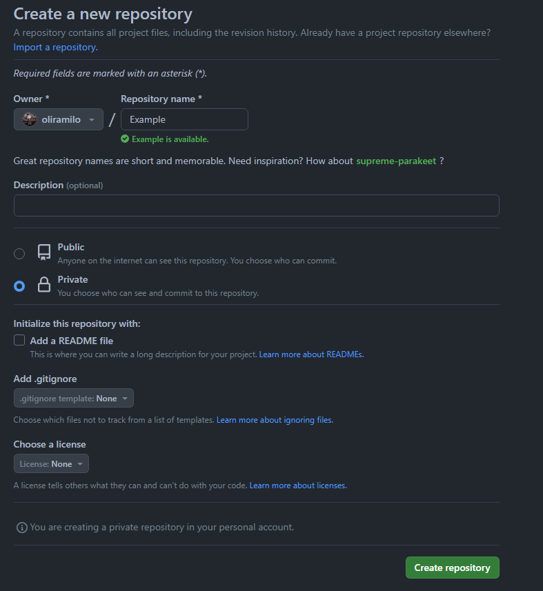
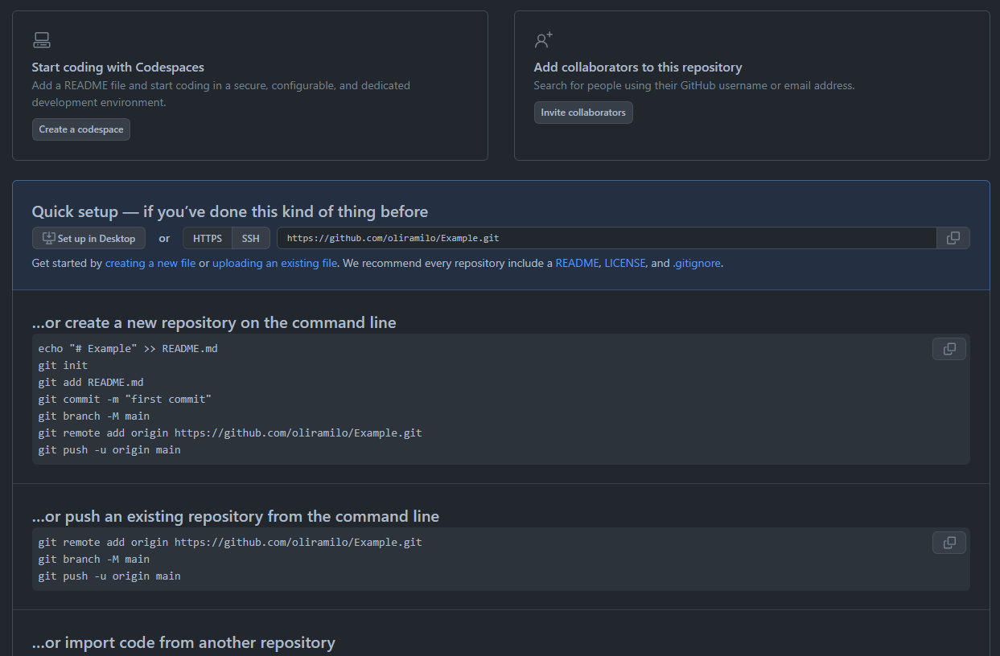
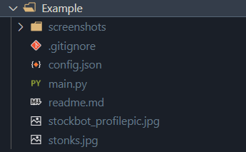

# fork-to-private-repo
## Forking a public repository to your private repository

1. Obtain the repository link you want to fork. For the example below the link is https://github.com/oliramilo/Stockbot.git

2. Go to your terminal, for this one I'm using the terminal in VSCode: use the command git clone --bare (repository link). i.e git clone --bare https://github.com/oliramilo/Stockbot.git

A git file will be cloned to the current directory: 

## use cd to change to the bare clone directory 

## Now create your private repo

## Copy the git repository link

## Use: git push --mirror (private repository link)

Example Below: git push --mirror https://github.com/oliramilo/Example.git

## Go back a directory and clone your private repo

## Contents will appear in your private repository

